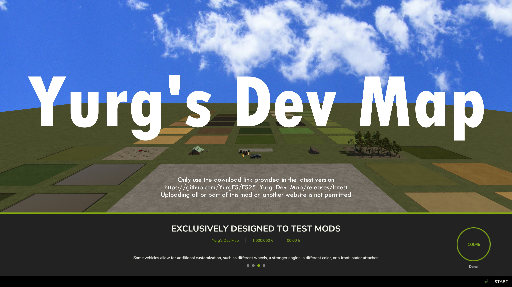

 

# Yurg's Dev Map

> [!IMPORTANT]
> THIS MAP IS ABSOLUTELY NOT DESIGNED FOR NORMAL CAREER PLAY MODE.

If you are not a modder, this map is unlikely to be useful for you.
Except perhaps to test certain mods that have a strong impact on a game before adding it to your main game.

Some ayatollahs, who believe that everyone should play like them, seems to have great fun giving a single star to any mod that does not interest them or does not seems real to them.

Therefore do not hesitate to rate the mod after you have tested it, and/or add a comment if something is not right for you.

Your comments and suggestions are welcome.

## Why this map?

I know we can use some console commands like ggsI3DCacheClean, gsStoreItemsReload, gsVehicleReload

But in the end we often need to restart the game, reason why I decided to create a light, fast-loading map for mod testing.

## What does it offer?

It comes with:
- vehicle shop & animal dealer triggers
- a farm house, workshop, farmer's market and sawmill
- 6 golden apples that will give you 2M each if you need money
- fields for all crops ready to harvest
- fields for wheat at distinct growing stages
- grapes & olives at distinct growing stages
- trees at different growing stages & a few rocks
- some fields with nothing on it to test implements
- some vehicles ready to use
- mission might be available (12 unowned fields)

Based on Sample Mod Map by GWENDAL
- https://www.kingmods.net/en/fs25/mods/59470/sample-mod-map
- https://www.youtube.com/@GWENDALYT

# Recommend Mods

Here is a list of mods I do recommend:
- https://www.kingmods.net/en/fs25/packs/3529/recommended-mods

# Support

For any issue, suggestion or question, please use one of the following:
- https://github.com/YurgFS/FS25_Yurg_Dev_Map/issues/new/choose
- https://www.kingmods.net/en/search?games=fs25&q=Yurg+Dev+Map

# Licence

<picture>
  <source media="(prefers-color-scheme: dark)" srcset="res/cc/cc-logo-white.svg">
  <source media="(prefers-color-scheme: light)" srcset="res/cc/cc-logo-black.svg">
  
</picture>
<picture>
  <source media="(prefers-color-scheme: dark)" srcset="res/cc/cc-by-white.svg">
  <source media="(prefers-color-scheme: light)" srcset="res/cc/cc-by-black.svg">
  
</picture>
<picture>
  <source media="(prefers-color-scheme: dark)" srcset="res/cc/cc-nc-white.svg">
  <source media="(prefers-color-scheme: light)" srcset="res/cc/cc-nc-black.svg">
  
</picture>
<picture>
  <source media="(prefers-color-scheme: dark)" srcset="res/cc/cc-nd-white.svg">
  <source media="(prefers-color-scheme: light)" srcset="res/cc/cc-nd-black.svg">
  
</picture>

Yurg's Dev Map © 2024 by Yurg is licensed under Creative Commons Attribution-NonCommercial-NoDerivatives 4.0 International.
- BY: Credit must be given to the creator.
- NC: Only noncommercial use of my work is permitted.
- ND: No derivatives or adaptations of my work are permitted.

To view a copy of this license, visit [CC BY-NC-ND 4.0](https://creativecommons.org/licenses/by-nc-nd/4.0/)

# Download

Only use the download link provided in the latest version:
- https://github.com/YurgFS/FS25_Yurg_Dev_Map/releases/latest

> [!CAUTION]
> Uploading all or part of this mod on another website is not permitted (only noncommercial use of my work is permitted).
